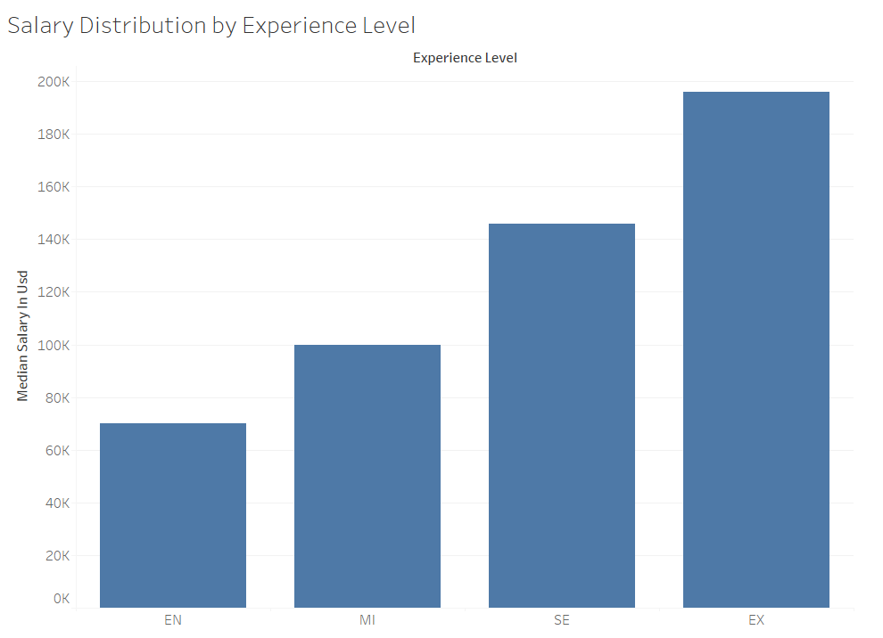
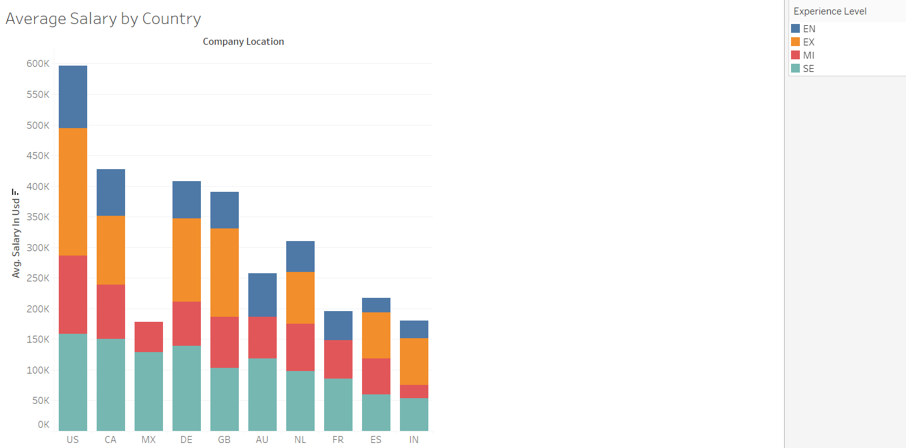
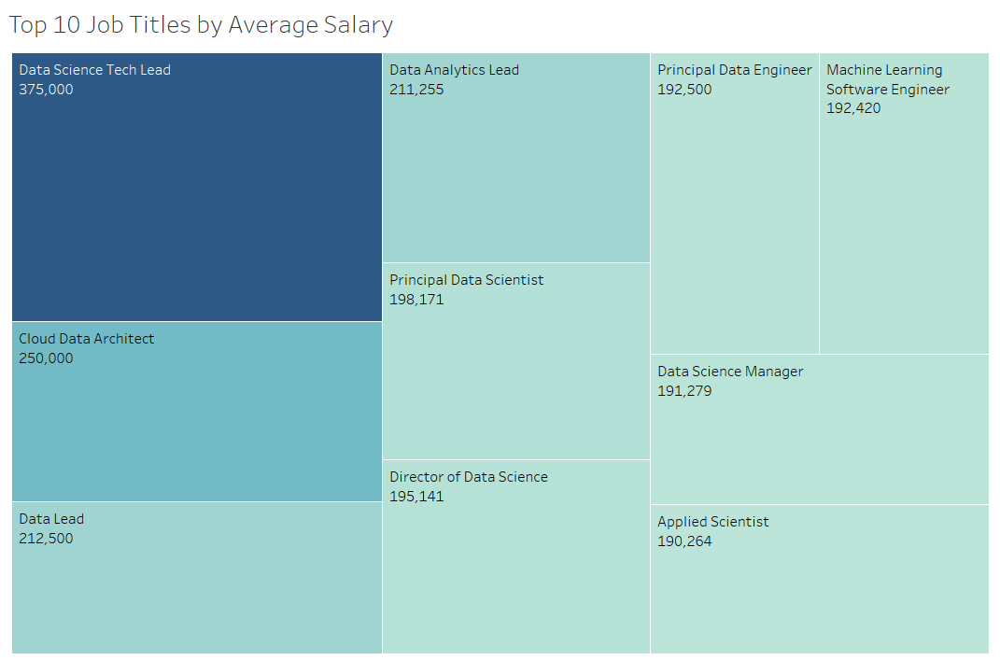
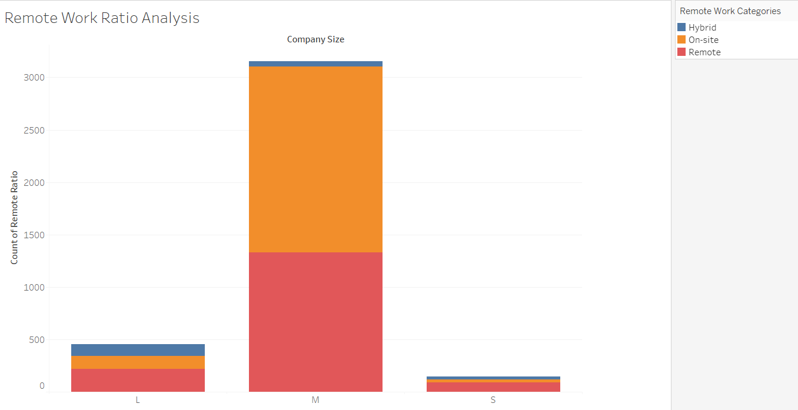

# DS Salaries Analysis

This project analyzes the salaries of data science roles based on factors like experience, country, job title, and remote work ratio. The analysis aims to provide insights into salary distribution across different demographics and job settings within the data science industry.

## Dataset

The dataset includes salary information (in USD) along with associated fields such as experience level, country, job title, and remote work ratio, which are used to create insightful visualizations.

## Features

### 1. Salary Distribution by Experience Level
   - **Objective**: Visualize the distribution of salaries based on experience level.
   - **Steps**:
     - **Create a Chart**: Plot a chart displaying the range of salaries (salary_in_usd) for each experience level (e.g., Entry, Mid, Senior, Executive).
     - **Analysis Goal**: Understand how salaries vary with experience and identify potential trends or outliers.

### 2. Average Salary by Country
   - **Objective**: Show the average salary for data science roles in each country, segmented by experience level.
   - **Steps**:
     - **Stacked Bar Chart**: Create a stacked bar chart to display average salary by country, with each bar segmented by experience level.
     - **Filter for Top 10 Countries**: Limit the chart to the top 10 countries with the highest total salary sums.
     - **Analysis Goal**: Highlight countries with the highest average salaries and how experience impacts salaries in different regions.

### 3. Top 10 Job Titles by Average Salary
   - **Objective**: Identify which job titles command the highest average salaries.
   - **Steps**:
     - **Create a Treemap**: Display the top 10 job titles based on their average salary.
     - **Analysis Goal**: Understand which job titles are the most lucrative within the data science field.

### 4. Remote Work Ratio Analysis
   - **Objective**: Analyze the proportion of remote work options (On-site, Hybrid, Remote) across different company sizes.
   - **Steps**:
     - **Categorize Remote Ratios**: Use a calculated field to group remote work ratios into 'On-site' (0%), 'Hybrid' (50%), and 'Remote' (100%).
     - **Stacked Bar Chart**: Create a stacked bar chart showing the distribution of these categories across different company sizes.
     - **Analysis Goal**: Examine trends in remote work preferences by company size, providing insights into remote work flexibility in data science roles.

